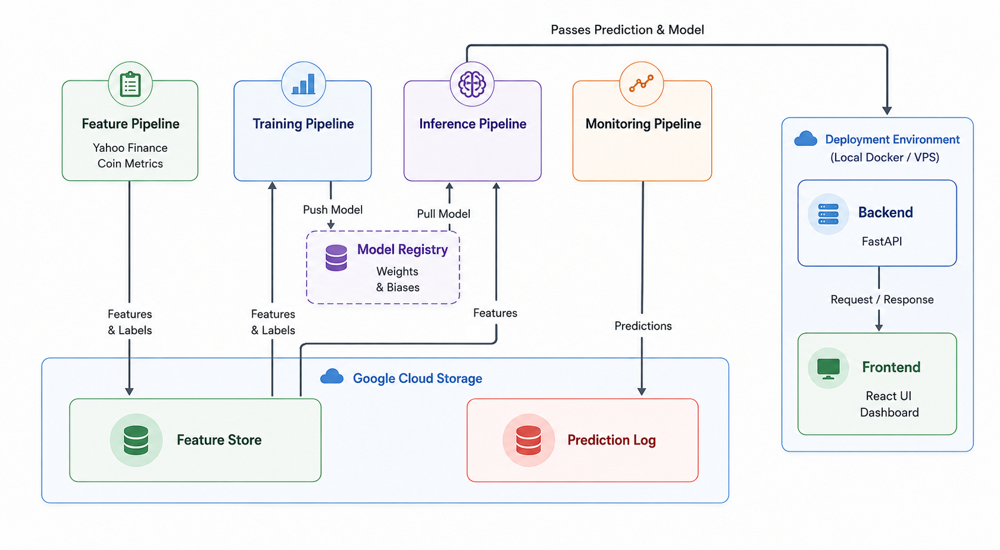

# MLOps Bitcoin On-Chain Predictor


An automated, cloud-deployed Machine Learning pipeline that predicts short-term Bitcoin price direction. Moving beyond static price history, this system leverages dynamic on-chain network data (like daily active addresses) to generate objective trading signals. It features fully decoupled Feature, Training, Inference, and Monitoring pipelines orchestrated via GitHub Actions, tracked with Weights & Biases, and served via a FastAPI and React web application.

 

---

## The Hook
Day trading carries immense risk, largely because humans struggle to process fast-moving market data without emotion. This project removes the human element by building a live, automated Machine Learning system that predicts the short-term (24-hour) price direction of Bitcoin based on raw network utility.

## Tech Stack

| Area | Technology |
|---|---|
| **Data Sources** | Yahoo Finance, CoinMetrics API |
| **Data Processing** | Python, Pandas, NumPy |
| **Model Training** | XGBoost, Scikit-Learn |
| **MLOps & Tracking** | Weights & Biases (W&B) |
| **Backend API** | FastAPI |
| **Frontend UI** | React, TailwindCSS, Vite |
| **Infrastructure** | Terraform, Google Cloud Storage |
| **Containerization** | Docker, Docker Compose |
| **CI/CD & Automation** | GitHub Actions, Make, uv, pytest |

## Project Architecture (FTI)
This project strictly follows the industry-standard **FTI (Feature, Training, Inference)** architecture, ensuring that data processing, model training, and live serving are completely decoupled. 

1. **Feature Pipeline (`ml_pipeline/feature_pipeline`):** Ingests daily price data from Yahoo Finance and on-chain network activity from CoinMetrics. It cleans the data, calculates financial indicators (momentum, volatility, moving averages), and loads it into a Google Cloud Storage (GCS) Feature Store.
2. **Training Pipeline (`ml_pipeline/training_pipeline`):** Loads historical data, performs chronological Walk-Forward validation, and executes Bayesian hyperparameter sweeps via Weights & Biases (W&B). The best XGBoost model is dynamically tagged as the "Champion" and saved to the model registry.
3. **Inference Pipeline (`backend` & `frontend`):** While the raw inference logic lives in `ml_pipeline`, the actual serving layer is intentionally decoupled into root-level `backend` (FastAPI) and `frontend` (React) directories. This microservice approach pulls the latest champion model into memory to serve live predictions to users.
4. **Monitoring Pipeline (`ml_pipeline/monitoring_pipeline`):** Runs nightly to grade the model's rolling 60-day precision. If performance drops below the threshold, it signals data drift and triggers an emergency hyperparameter sweep.

### Engineered Features
The feature pipeline extracts raw price and on-chain metrics to compute the following predictive indicators:

| Feature | Description |
|---|---|
| `return` | Daily percentage price change. |
| `ma_deviation_7d` | Distance between the current price and its 7-day moving average. |
| `ma_deviation_14d` | Distance between the current price and its 14-day moving average. |
| `volatility_7d` | Rolling 7-day standard deviation of price returns. |
| `momentum_7d` | Absolute price momentum over a 7-day window. |
| `address_change_1d` | Daily percentage change (velocity) of unique active addresses. |
| `address_momentum_7d` | Network adoption momentum (current active addresses vs. 7-day average). |
| `address_volatility_7d` | Rolling 7-day standard deviation of active address changes. |
| `target` | **Target variable**: 1 if tomorrow's price goes up, 0 if it drops. |

### Repository Structure
```text
.
├── .github/workflows/      # GitHub Actions
├── .secrets/               # GCP service account JSON keys
├── backend/                # FastAPI serving service and API routers
├── frontend/               # React UI
├── ml_pipeline/
│   ├── config/             # Shared constants and path definitions
│   ├── feature_pipeline/   # Ingestion, transformations, and Feature Store logic
│   ├── inference_pipeline/ # Live data fetching and model prediction logic
│   ├── monitoring_pipeline/# Data drift detection and precision tracking
│   ├── training_pipeline/  # Walk-forward validation, W&B sweeps, model building
│   └── utils/              # Helper functions
├── terraform/              # IaC to provision the GCP Storage Bucket
├── tests/                  # Pytest unit test suite
├── .dockerignore           # Docker build exclusion rules
├── .env.example            # Environment variables template
├── .gitignore              # Git exclusion rules
├── docker-compose.yaml     # Multi-container deployment
├── Makefile                # Pipeline execution commands
├── pyproject.toml          # uv dependency management
├── README.md               # Project documentation
├── SECURITY.md             # Security and vulnerability policies
└── uv.lock                 # Locked dependencies
```
---

## Prerequisites

Before deploying or running the pipelines, ensure you have the following tools installed and accounts configured:

- [Docker Desktop](https://www.docker.com/products/docker-desktop/) (Running in the background)
- [Terraform CLI](https://developer.hashicorp.com/terraform/install)
- [uv](https://docs.astral.sh/uv/getting-started/installation/) (Python 3.11+ package manager)
- [Google Cloud Platform](https://console.cloud.google.com/) (GCP) Account
- [Weights & Biases](https://wandb.ai/) (W&B) Account

---

## Setup Guide

### 1. Install Dependencies

To develop locally or test the pipelines outside of Docker, install the Python dependencies using `uv`:
```bash
uv sync --all-extras
```

### 2. Google Cloud & Terraform Setup

#### Step 1: Google Cloud Project Initialization

1. Log into the Google Cloud Console.
2. Click the project dropdown at the top of the screen and select **New Project**.
3. **Project Name:** You can name this anything (e.g., `Bitcoin ML Predictor`).
4. **Project ID:** Google will auto-generate an ID under the name. Note this ID down.
5. Click **Create**.

#### Step 2: Check Required APIs

You must ensure Google Cloud has activated the services we need.

1. In the top search bar of the GCP Console, type **APIs & Services** and select **Library**.
2. Search for **Cloud Storage API**. Click it, and check if it is enabled (if the button says "Manage", it is already active; otherwise, click "Enable").

#### Step 3: Service Accounts & Keys

To ensure strict security and the Principle of Least Privilege, this project uses two separate service accounts.

**1. Create the Terraform Service Account:**

* Go to **IAM & Admin** > **Service Accounts** and click **Create Service Account**.
* Name it `terraform-deployer` and click **Create and continue**.
* Grant the `Storage Admin` role (Allows creating/deleting buckets).
* Click **Done**.
* Back on the Service Accounts table, click the **Actions dots** (three vertical dots) on the right side of the `terraform-deployer` row and select **Manage keys**.
* Click **Add Key** > **Create new key** (JSON).
* Download the key, rename it to `gcp-key-terraform.json`, and move it directly into the `.secrets/` folder in your repository.

**2. Create the Pipeline Service Account:**

* Go back to **Service Accounts** and click **Create Service Account**.
* Name it `pipeline-runner` and click **Create and continue**.
* Grant the `Storage Object Admin` role (Allows reading/writing data, but protects the bucket from deletion).
* Click **Done**.
* Back on the Service Accounts table, click the **Actions dots** on the right side of the `pipeline-runner` row and select **Manage keys**.
* Click **Add Key** > **Create new key** (JSON).
* Download the key, rename it to `gcp-key-pipeline.json`, and move it into the `.secrets/` folder.

#### Step 4: Configure Environment Variables

Before provisioning infrastructure, you must set up your local environment file.

1. In the root of the repository, rename the `.env.example` file to `.env`.
2. Fill in your specific credentials so your pipelines can talk to your cloud infrastructure:
    * `WANDB_API_KEY` & `WANDB_ENTITY`: Found in your Weights & Biases account settings.
    * `SWEEP_ID`: **Leave this as it is.**
    * `GOOGLE_APPLICATION_CREDENTIALS`: Path to your pipeline Google Cloud JSON key (default is `./.secrets/gcp-key-pipeline.json`).
    * `GCS_BUCKET_NAME`: The exact bucket name you will create with Terraform. **This must be globally unique.**
    * `STORAGE_MODE`: Leave this on `cloud` so that the Feature Store is stored in Google Cloud Storage.

#### Step 5: Provision Infrastructure (Terraform)

We use Terraform to deploy the Feature Store Data Lake. Just like the `.env` file, Terraform needs to be configured with your specific cloud values before it can run.

1. Navigate to the `terraform/` directory:
```bash
cd terraform
```
2. Rename the variables template file from `terraform.tfvars.example` to `terraform.tfvars`
3. Edit `terraform.tfvars` and fill in the exact same **GCP project ID** and **bucket name** that you used in your `.env` file.
4. Run the Terraform commands to build the infrastructure:
```bash
terraform init
terraform plan
terraform apply
```
*(Confirm with `yes` to build the GCS bucket. When you are done with the project, you can run `terraform destroy` to tear it down and stop incurring costs).*

---

## Deployment & Automation

This system is fully automated via **GitHub Actions** and deployed via **Docker**. To enable cloud automation, you must configure your repository settings in GitHub under **Settings > Secrets and variables > Actions**.

**Add these as Repository Secrets:**
- `WANDB_API_KEY`: Your Weights & Biases API key.
- `WANDB_ENTITY`: Your Weights & Biases entity/username.
- `GCP_PIPELINE_KEY_JSON`: Paste the raw JSON text of your pipeline service account key directly into the value field.

**Add these as Repository Variables:**
- `GCS_BUCKET_NAME`: The exact name of your Google Cloud Storage bucket.
- `STORAGE_MODE`: Set to `cloud`.
- `VPS_IP`: The IP address of your deployment server.

### GitHub Actions Workflows
- **Nightly Run (`nightly.yaml`):** Runs every day at night. It fetches yesterday's data, checks for data drift, and updates the monitoring logs. If drift is detected, it automatically triggers `sweep.yaml`.
- **Sweep Training (`sweep.yaml`):** Triggered automatically by the Nightly run if data drift occurs (or can be triggered manually). It spins up a massive hyperparameter search to rescue the model, selects a new champion, and hot-swaps it in production.
- **Project Setup (`setup.yaml`):** Run this manually once at the very beginning of the project. It executes a historical data backfill and then automatically calls `sweep.yaml` to run the first hyperparameter sweep and log the first champion model.
- **CI Pipeline (`ci.yaml`):** Runs the full unit test suite on every push or Pull Request to ensure pipeline integrity before merging to main.

### Running the Web Application (Inference UI)
To spin up the FastAPI backend and React frontend on your local machine, run:

```bash
docker-compose up -d --build
```

The application will be available at:
- **Frontend UI:** http://localhost

When you are finished testing, you can safely stop the containers by running:

```bash
docker-compose down -v
```

---

## Development & Makefile Commands
If you are developing locally, you can trigger individual pipelines using the included Makefile:

```bash
# Feature Pipeline
make feature-pipeline                  # Fetches incremental 30-day data
make backfill START_DATE="2016-06-01"  # Extracts full history from a specific date

# Training Pipeline
make sweep-training ARGS="--count 200" # Runs W&B Bayesian hyperparameter search
make select-champion                   # Identifies and downloads the best configuration
make training-pipeline                 # Trains model with the best configuration

# Inference & Monitoring Pipelines
make inference-pipeline                # Tests live inference locally
make backfill-predictions              # Generates historical predictions for monitoring
make monitoring-pipeline               # Grades performance and checks for data drift

# Testing
make test                              # Runs the complete pytest suite
```